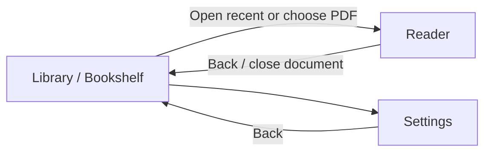
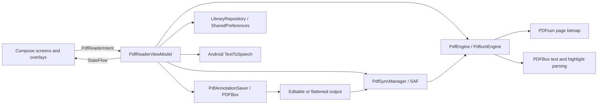

# NoxReader Architecture

## Product vision

NoxReader is a focused Android PDF reader for people who want a calm library, fast page navigation, lightweight annotation, and durable changes without uploading documents to an application-owned cloud.

The experience should feel:

- **Quiet:** reading content dominates; controls stay compact and contextual.
- **Trustworthy:** saves are explicit, progress is visible, and destructive actions require confirmation or a clear selected target.
- **Local-first:** files remain at the Storage Access Framework (SAF) location selected by the user; only library metadata and preferences are stored by the app.
- **Responsive:** page rendering, text extraction, PDF mutation, and provider I/O never block Compose.
- **Accessible:** controls use meaningful labels, at least 48 dp touch targets where practical, system-aware color contrast, and non-color selected states.

## Information architecture

Navigation is implemented by a Compose `NavHost` in `MainActivity`:

| Route | Purpose | Primary actions |
|---|---|---|
| `bookshelf` | Home and document history | Continue reading, open a recent PDF, choose a PDF, open Settings |
| `reader` | Read and annotate the active document | Change page, zoom, bookmark, read aloud, annotate, choose save mode, save |
| `settings` | App-level preferences and local-data controls | Theme, keep screen awake, speech rate, clear recent history |

Opening a document is state-driven. The bookshelf observes `isPdfLoaded` and navigates to the reader only after the file has opened successfully.

## Feature experience ownership

User-visible behavior belongs to the task-routed feature blueprints rather than
this shared contract. Load the manifest entry for the requested capability:

- [Document library](../feature-blueprints/document-library.md) owns opening,
  recents, resume position, bookmarks, and library states.
- [PDF rendering](../feature-blueprints/pdf-rendering.md) owns the reader canvas,
  paging, zoom, and render feedback.
- [Read aloud](../feature-blueprints/read-aloud.md) owns playback controls,
  chunking, synchronized highlighting, and TTS errors.
- [Reader preferences](../feature-blueprints/reader-preferences.md) owns settings
  behavior, theme selection, keep-awake, speech rate, and history clearing.
- Annotation interaction and save behavior belong to their corresponding
  blueprints in the [feature manifest](../feature-blueprints/README.md).

## Visual system

### Color

The Material 3 palette is defined in `presentation/theme/Color.kt`.

- Light surfaces use a warm paper background (`#FAF9F7`) and white lowest containers.
- Primary navy (`#03192E`) anchors high-emphasis actions and selected states.
- Tertiary brown-gold supports warmth without competing with document content.
- Dark mode uses near-black blue surfaces and the corresponding light primary.
- Material semantic colors must be used instead of hard-coded screen colors, except annotation colors and purpose-specific overlay colors.

### Typography

The hierarchy combines an editorial serif voice with a utilitarian sans-serif UI:

- Serif: display titles, headings, and long-form reading styles.
- Sans serif: buttons, labels, metadata, and settings.
- Current code uses Android system serif/sans-serif families for crash-free offline startup. Source Serif 4 and Inter are token names and future bundled-font candidates, not downloaded runtime dependencies.

### Spacing and layout

Spacing tokens live in `NoxReaderSpacing`:

| Token | Value | Use |
|---|---:|---|
| Base | 8 dp | Small rhythm unit |
| Mobile margin | 20 dp | Standard phone content inset |
| Gutter | 24 dp | Section and column separation |
| Desktop margin | 64 dp | Future larger-window layouts |
| Reading max width | 720 dp | Comfortable content width |

Feature blueprints own screen-specific width caps and component arrangements.
Interactive controls use at least 48 dp touch targets where practical and must
remain clear of floating actions and system insets.

### Motion

Motion communicates state rather than decoration. Feature blueprints define the
specific transition and its trigger. Transitions must remain short,
non-essential, and safe to disable when reduced-motion support is added.

## Component model and state ownership

NoxReader uses MVI-style unidirectional state with Clean Architecture boundaries.

| Layer | Responsibility | Main components |
|---|---|---|
| Presentation | Compose UI, immutable state, intents, gesture interpretation, optimistic overlays | `BookshelfScreen`, `PdfReaderScreen`, `SettingsScreen`, `PdfReaderViewModel`, `PdfReaderState` |
| Domain | Stable engine, saving, sync, library, and TTS contracts/models | `PdfEngine`, `PdfAnnotationSaver`, `PdfSyncManager`, `LibraryRepository`, library models |
| Data | PDFium, PDFBox Android, SAF, and SharedPreferences implementations | `PdfiumEngine`, `PdfAnnotationWriterImpl`, `SafPdfSyncManager`, `SharedPreferencesLibraryRepository` |

Dependencies are manually assembled in `MainActivity`. Shared state is owned by one activity-scoped `PdfReaderViewModel` and exposed through `StateFlow`.

## Document and annotation pipeline

PDFBox compatibility is pinned to `com.tom-roush:pdfbox-android:2.0.27.0`. This Android PDFBox 2.x fork does not expose every newer upstream API. Ink uses `PDAnnotationMarkup` with `/Subtype /Ink`; text notes and markup appearances must use APIs verified against the pinned AAR.

### Coordinate system

Domain and UI annotation geometry uses normalized `0..1` display-space
coordinates with a top-left origin. Durable PDF geometry uses PDF points and
the page box used for rendering, normally CropBox with MediaBox fallback.

`PdfCoordinateMapper` is the single conversion boundary. It accounts for page
dimensions and right-angle rotation; feature code must not introduce ad-hoc DPI
scaling, Y-axis flips, or MediaBox-only conversions. For an unrotated page of
width `W` and height `H`, the shared mapping is `pdfX = x * W` and
`pdfY = (1 - y) * H`.

The same bidirectional transform applies to rendering bounds, pointer input,
text geometry, hit-testing, annotation rectangles, quad points, ink paths, and
note anchors. Portrait, landscape, cropped, rotated, and non-standard pages
must remain covered by mapper tests.

### Rendering and overlay model

PDFium owns the static page-bitmap layer. Compose owns pending annotations,
gesture previews, selection feedback, handles, and contextual actions. Pointer
interaction updates optimistic MVI state without mutating PDFBox or rerendering
the base page.

Rendering, overlays, and hit-testing share the fitted page `contentBounds`
transform. The current implementation renders one full-page bitmap; viewport
tiles, bounded bitmap eviction, obsolete-request cancellation, and complete
zoom panning remain planned and must not be described as shipped.

### Commit pipeline

1. The Android document picker returns a persistable SAF URI.
2. The ViewModel reads the file on `Dispatchers.IO`, retaining raw bytes for PDFBox and a file descriptor for PDFium.
3. PDFium renders static page bitmaps. PDFBox supplies positioned word/character geometry and embedded highlight metadata.
4. Compose records pending annotation changes in immutable MVI state.
5. Save snapshots pending state and writes a temporary PDF off the main thread.
6. The sync layer copies the result to the original SAF URI.
7. The engine reopens the synchronized document and increments `renderRevision`.
8. Only successfully persisted overlays and deletions are cleared.

### Text geometry and highlighting

Text extraction retains word bounds and per-character bounds. `TextHighlightSelector` resolves drag endpoints into reading-order cursors and creates a continuous range:

- start cursor to end of the first line;
- all complete intervening lines;
- beginning of the final line through the end cursor.

Reverse drags normalize to the same result. Preview and persistence use identical normalized rectangles.

### Save modes

- **Editable:** preserves new `/Annots` for highlights, ink, and text notes. Highlight normal appearances paint selected quads with the configured opacity.
- **Flattened:** paints newly created supported annotations into page `/Contents`, then removes only those newly created annotation entries. Existing annotations remain intact. Flattening is irreversible.

An annotation may be removed only after its complete supported payload has been
represented in page content. If lossless flattening is unavailable for a
particular payload, keep that annotation editable rather than silently dropping
user data.

The annotation union rectangle is metadata only and must never be rendered as a solid highlight because it can obscure text between selected lines.

### Failure handling and invalidation

Opening may succeed while save-back fails because a SAF provider is read-only
or unavailable. A failed write, sync, or reopen keeps pending overlays,
deletions, and note contents available for retry and exposes an actionable
error.

A successful reopen clears page-scoped text and embedded-highlight caches and
increments `renderRevision` before persisted optimistic items are removed.
Future tile caches must include document version, page, viewport, zoom, and tile
identity and must invalidate affected entries only after commit succeeds.

## Local data and privacy

`SharedPreferencesLibraryRepository` stores only:

- document URI and display title;
- page count and last page;
- last-opened timestamp;
- bookmarked page indices;
- theme, keep-awake, and speech-rate preferences.

PDF contents stay at their selected SAF location. The file provider determines whether save-back is available; read-only sources may open but cannot be updated.

## Performance and lifecycle

- Rendering, text extraction, PDFBox parsing/writing, SAF I/O, and preference disk access run off the main thread.
- PDFBox uses `MemoryUsageSetting.setupMixed(50 MiB)`.
- Render callbacks keep bitmap objects out of `PdfReaderState`.
- Page text and embedded highlights are cached per open document.
- PDF documents, descriptors, TTS resources, and temporary save files must be released on replacement, close, completion, and failure paths.
- Saving never clears optimistic state before sync and reopen succeed.

## Validation and delivery

- JVM test sources cover coordinate mapping, overlapping-highlight hit testing,
  contiguous/reverse text selection, flattened note text retention, and
  flattened ink width under `app/src/test`.
- GitHub Actions is the build and test authority; repository guidance intentionally forbids local Gradle execution.
- `.github/workflows/build.yml` builds a release APK for pushes and pull requests
  targeting `master`; it currently runs `assembleRelease` without an explicit
  unit-test or lint task.
- `.github/workflows/gh-release.yml` publishes release APKs for pushes to `main` or `feature`. Note that `main` and `master` are distinct branch names; workflow changes must keep branch policy explicit.
- `.github/workflows/gh-release-gptoss.yml` publishes the separate `gptoss` branch release.

## Cross-cutting gaps

- Device and Compose UI coverage does not yet verify accessibility, rotation,
  process recreation, or provider-failure recovery across feature domains.
- Resource ownership and cancellation need stress coverage for rapid document
  replacement, paging, saving, and activity destruction.
- Supported PDF mutations need a maintained provider and external-viewer
  compatibility matrix.
- Product typography still relies on system serif and sans-serif families;
  bundling fonts would be a cross-screen visual-system change.

## Feature blueprints

[`feature-blueprints/README.md`](../feature-blueprints/README.md) is the task
router for progressive agent context loading. Shared contracts remain
authoritative here; each blueprint states how they constrain that feature.

| Blueprint | Current scope |
|---|---|
| [`pdf-rendering.md`](../feature-blueprints/pdf-rendering.md) | Page rendering, transforms, zoom, caching, and lifecycle |
| [`annotation-persistence.md`](../feature-blueprints/annotation-persistence.md) | Editable/flattened save, SAF sync, reopen, and failure recovery |
| [`text-highlighting.md`](../feature-blueprints/text-highlighting.md) | Text selection, embedded-highlight interaction, deletion, and geometry |
| [`freehand-annotation.md`](../feature-blueprints/freehand-annotation.md) | Pen/freehand strokes, erasing, ink output, and flattening |
| [`text-notes.md`](../feature-blueprints/text-notes.md) | Note placement, editing, display, and persistence |
| [`document-library.md`](../feature-blueprints/document-library.md) | PDF selection, persisted access, recents, progress, and bookmarks |
| [`read-aloud.md`](../feature-blueprints/read-aloud.md) | TTS lifecycle, chunking, synchronized highlighting, and playback controls |
| [`reader-preferences.md`](../feature-blueprints/reader-preferences.md) | Theme, screen-awake, speech-rate, privacy, and history controls |
