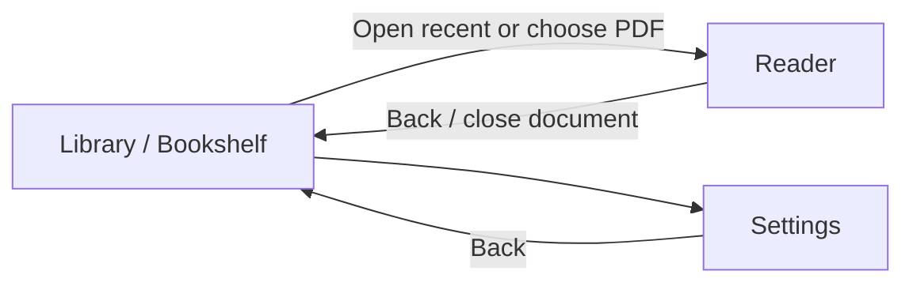
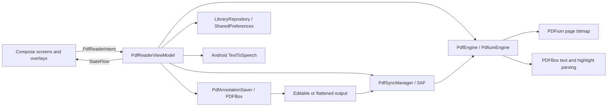

# NoxReader Architecture

## Product vision

NoxReader is a focused Android PDF reader for people who want a calm library, fast page navigation, lightweight annotation, and durable changes without uploading documents to an application-owned cloud.

The experience should feel:

- **Quiet:** reading content dominates; controls stay compact and contextual.
- **Trustworthy:** saves are explicit, progress is visible, and destructive actions require confirmation or a clear selected target.
- **Local-first:** files remain at the Storage Access Framework (SAF) location selected by the user; only library metadata and preferences are stored by the app.
- **Responsive:** page rendering, text extraction, PDF mutation, and provider I/O never block Compose.
- **Accessible:** controls use meaningful labels, at least 48 dp touch targets where practical, system-aware color contrast, and non-color selected states.

## Information architecture

Navigation is implemented by a Compose `NavHost` in `MainActivity`:

| Route | Purpose | Primary actions |
|---|---|---|
| `bookshelf` | Home and document history | Continue reading, open a recent PDF, choose a PDF, open Settings |
| `reader` | Read and annotate the active document | Change page, zoom, bookmark, read aloud, annotate, choose save mode, save |
| `settings` | App-level preferences and local-data controls | Theme, keep screen awake, speech rate, clear recent history |

Opening a document is state-driven. The bookshelf observes `isPdfLoaded` and navigates to the reader only after the file has opened successfully.

## Experience specification

### Library

The library uses a restrained editorial hierarchy:

1. A compact app bar identifies NoxReader as "Your quiet reading space."
2. The most recently opened document is promoted as a **Continue reading** card with animated progress.
3. Remaining items appear in a scannable **Recent documents** list with title, current page, page count, progress, and bookmark count.
4. A persistent **Open PDF** extended FAB is shown when history exists.
5. A first-run empty state explains the product and provides a prominent **Choose a PDF** action.

Required states:

- **Loading:** centered progress indicator while local library metadata is read.
- **Empty:** product introduction, file picker CTA, storage note, and any recoverable error.
- **Populated:** continue card, recent list, progress, and open-file FAB.
- **Opening:** linear progress at the top of the list; existing content remains visible.
- **Error:** dismissible inline banner that does not erase the library.

The list is capped at 20 recent documents. Selecting a recent entry reuses its persisted SAF URI and resumes at the last valid page.

### Reader

The reader prioritizes the page canvas while keeping document status and important actions reachable.

#### Top app bar

- Back closes the active document and returns to the library.
- Title is single-line and ellipsized.
- Page position is always shown as `Page N of M`.
- `Edit` / `Flat` toggles the annotation save mode.
- Save is disabled until there are pending annotations or embedded-highlight deletions and shows progress while writing.
- Bookmark toggles the current page and exposes a state-specific accessibility label.

#### Page canvas

- Pages are horizontally paged.
- Each page is rendered as a fitted ARGB bitmap with a fade-in.
- Pinch zoom is clamped from 1x to 5x.
- Text geometry is overlaid transparently for selection and synchronized read-aloud highlighting.
- Unsaved strokes, highlights, text notes, current gesture previews, and selected-highlight actions remain Compose overlays until Save succeeds.

The current renderer is full-page bitmap based. Tile rendering, bitmap eviction, zoom panning, render cancellation, and a page scrubber are not yet complete and must not be presented as shipped features.

#### Floating tool system

The bottom pill toolbar provides:

- **Read aloud:** opens play/pause/resume/stop controls.
- **Pen:** creates freehand ink with the selected color.
- **Highlighter:** selects text using cached character geometry; if no text range is resolved, the gesture falls back to a freehand highlight stroke.
- **Eraser:** removes matching unsaved strokes and session highlights along a drag.
- **Add text:** places an editable note field at the tapped location.
- **Palette:** edits pen and highlighter color sets.

Pen and Highlighter show a contextual palette above the main toolbar. A selected tool uses a filled container plus icon tint, rather than color alone. Tool actions use 48 dp icon buttons and semantic labels.

#### Existing highlight selection

With no annotation tool active, tapping an embedded or session highlight selects the smallest matching target. Selection is represented by a dashed blue union boundary and an anchored **Delete** action. Deletion updates optimistic UI state and is persisted only after Save.

#### Feedback and recovery

- Opening, rendering, saving, and read-aloud each expose visible progress or state.
- A reader load failure provides a **Choose another PDF** recovery action.
- Save failures retain pending overlays and show an error; pending state is cleared only after the updated source reopens successfully.

### Settings

Settings are grouped into readable cards:

- **Appearance:** System, Light, and Dark theme modes.
- **Reading:** keep screen awake and read-aloud speed from 0.6x to 1.6x.
- **Privacy & storage:** explains on-device history and clears recent metadata.
- **About:** product name and version.

Clearing recent history requires confirmation and explicitly states that PDF files are not deleted.

## Visual system

### Color

The Material 3 palette is defined in `presentation/theme/Color.kt`.

- Light surfaces use a warm paper background (`#FAF9F7`) and white lowest containers.
- Primary navy (`#03192E`) anchors high-emphasis actions and selected states.
- Tertiary brown-gold supports warmth without competing with document content.
- Dark mode uses near-black blue surfaces and the corresponding light primary.
- Material semantic colors must be used instead of hard-coded screen colors, except annotation colors and purpose-specific overlay colors.

### Typography

The hierarchy combines an editorial serif voice with a utilitarian sans-serif UI:

- Serif: display titles, headings, and long-form reading styles.
- Sans serif: buttons, labels, metadata, and settings.
- Current code uses Android system serif/sans-serif families for crash-free offline startup. Source Serif 4 and Inter are token names and future bundled-font candidates, not downloaded runtime dependencies.

### Spacing and layout

Spacing tokens live in `NoxReaderSpacing`:

| Token | Value | Use |
|---|---:|---|
| Base | 8 dp | Small rhythm unit |
| Mobile margin | 20 dp | Standard phone content inset |
| Gutter | 24 dp | Section and column separation |
| Desktop margin | 64 dp | Future larger-window layouts |
| Reading max width | 720 dp | Comfortable content width |

Library content is capped at 760 dp and Settings at 720 dp. Rounded cards, restrained elevation, 48 dp icon buttons, and generous bottom padding keep controls readable and clear of floating actions.

### Motion

Motion communicates state rather than decoration:

- Recent-document progress animates to its stored value.
- Page content fades in after rendering.
- Page transitions crossfade within horizontal paging.
- Contextual annotation palettes appear only for the active drawing tool.

Respect a future reduced-motion setting by keeping transitions short and non-essential.

## Architecture

NoxReader uses MVI-style unidirectional state with Clean Architecture boundaries.

| Layer | Responsibility | Main components |
|---|---|---|
| Presentation | Compose UI, immutable state, intents, gesture interpretation, optimistic overlays | `BookshelfScreen`, `PdfReaderScreen`, `SettingsScreen`, `PdfReaderViewModel`, `PdfReaderState` |
| Domain | Stable engine, saving, sync, library, and TTS contracts/models | `PdfEngine`, `PdfAnnotationSaver`, `PdfSyncManager`, `LibraryRepository`, library models |
| Data | PDFium, PDFBox Android, SAF, and SharedPreferences implementations | `PdfiumEngine`, `PdfAnnotationWriterImpl`, `SafPdfSyncManager`, `SharedPreferencesLibraryRepository` |

Dependencies are manually assembled in `MainActivity`. Shared state is owned by one activity-scoped `PdfReaderViewModel` and exposed through `StateFlow`.

## Document and annotation pipeline

PDFBox compatibility is pinned to `com.tom-roush:pdfbox-android:2.0.27.0`. This Android PDFBox 2.x fork does not expose every newer upstream API. Ink uses `PDAnnotationMarkup` with `/Subtype /Ink`; text notes and markup appearances must use APIs verified against the pinned AAR.

### Coordinate system

Domain and UI annotation geometry uses normalized `0..1` display-space
coordinates with a top-left origin. Durable PDF geometry uses PDF points and
the page box used for rendering, normally CropBox with MediaBox fallback.

`PdfCoordinateMapper` is the single conversion boundary. It accounts for page
dimensions and right-angle rotation; feature code must not introduce ad-hoc DPI
scaling, Y-axis flips, or MediaBox-only conversions. For an unrotated page of
width `W` and height `H`, the shared mapping is `pdfX = x * W` and
`pdfY = (1 - y) * H`.

The same bidirectional transform applies to rendering bounds, pointer input,
text geometry, hit-testing, annotation rectangles, quad points, ink paths, and
note anchors. Portrait, landscape, cropped, rotated, and non-standard pages
must remain covered by mapper tests.

### Rendering and overlay model

PDFium owns the static page-bitmap layer. Compose owns pending annotations,
gesture previews, selection feedback, handles, and contextual actions. Pointer
interaction updates optimistic MVI state without mutating PDFBox or rerendering
the base page.

Rendering, overlays, and hit-testing share the fitted page `contentBounds`
transform. The current implementation renders one full-page bitmap; viewport
tiles, bounded bitmap eviction, obsolete-request cancellation, and complete
zoom panning remain planned and must not be described as shipped.

### Commit pipeline

1. The Android document picker returns a persistable SAF URI.
2. The ViewModel reads the file on `Dispatchers.IO`, retaining raw bytes for PDFBox and a file descriptor for PDFium.
3. PDFium renders static page bitmaps. PDFBox supplies positioned word/character geometry and embedded highlight metadata.
4. Compose records pending annotation changes in immutable MVI state.
5. Save snapshots pending state and writes a temporary PDF off the main thread.
6. The sync layer copies the result to the original SAF URI.
7. The engine reopens the synchronized document and increments `renderRevision`.
8. Only successfully persisted overlays and deletions are cleared.

### Text geometry and highlighting

Text extraction retains word bounds and per-character bounds. `TextHighlightSelector` resolves drag endpoints into reading-order cursors and creates a continuous range:

- start cursor to end of the first line;
- all complete intervening lines;
- beginning of the final line through the end cursor.

Reverse drags normalize to the same result. Preview and persistence use identical normalized rectangles.

### Save modes

- **Editable:** preserves new `/Annots` for highlights, ink, and text notes. Highlight normal appearances paint selected quads with the configured opacity.
- **Flattened:** paints newly created supported annotations into page `/Contents`, then removes only those newly created annotation entries. Existing annotations remain intact. Flattening is irreversible.

The annotation union rectangle is metadata only and must never be rendered as a solid highlight because it can obscure text between selected lines.

### Failure handling and invalidation

Opening may succeed while save-back fails because a SAF provider is read-only
or unavailable. A failed write, sync, or reopen keeps pending overlays,
deletions, and note contents available for retry and exposes an actionable
error.

A successful reopen clears page-scoped text and embedded-highlight caches and
increments `renderRevision` before persisted optimistic items are removed.
Future tile caches must include document version, page, viewport, zoom, and tile
identity and must invalidate affected entries only after commit succeeds.

## Local data and privacy

`SharedPreferencesLibraryRepository` stores only:

- document URI and display title;
- page count and last page;
- last-opened timestamp;
- bookmarked page indices;
- theme, keep-awake, and speech-rate preferences.

PDF contents stay at their selected SAF location. The file provider determines whether save-back is available; read-only sources may open but cannot be updated.

## Performance and lifecycle

- Rendering, text extraction, PDFBox parsing/writing, SAF I/O, and preference disk access run off the main thread.
- PDFBox uses `MemoryUsageSetting.setupMixed(50 MiB)`.
- Render callbacks keep bitmap objects out of `PdfReaderState`.
- Page text and embedded highlights are cached per open document.
- PDF documents, descriptors, TTS resources, and temporary save files must be released on replacement, close, completion, and failure paths.
- Saving never clears optimistic state before sync and reopen succeed.

## Validation and delivery

- JVM tests cover coordinate mapping, overlapping-highlight hit testing, and contiguous/reverse text selection under `app/src/test`.
- GitHub Actions is the build and test authority; repository guidance intentionally forbids local Gradle execution.
- `.github/workflows/build.yml` builds a release APK for pushes and pull requests targeting `master`.
- `.github/workflows/gh-release.yml` publishes release APKs for pushes to `main` or `feature`. Note that `main` and `master` are distinct branch names; workflow changes must keep branch policy explicit.
- `.github/workflows/gh-release-gptoss.yml` publishes the separate `gptoss` branch release.

## Known gaps and next priorities

1. Add zoom panning and reset/double-tap behavior.
2. Add bounded bitmap eviction, render cancellation, and viewport/tile rendering for large documents.
3. Add page thumbnails or a scrubber for long-document navigation.
4. Validate editable and flattened output across major external PDF viewers and read-only providers.
5. Add device/Compose UI tests for accessibility, gestures, rotation, process recreation, and provider failures.
6. Bundle chosen serif/sans-serif fonts if product identity requires consistent typography across devices.
7. Consider an on-device neural voice only after size, latency, privacy, and fallback behavior are validated.

## Feature blueprints

[`feature-blueprints/README.md`](../feature-blueprints/README.md) is the task
router for progressive agent context loading. Shared contracts remain
authoritative here; each blueprint states how they constrain that feature.

| Blueprint | Current scope |
|---|---|
| [`pdf-rendering.md`](../feature-blueprints/pdf-rendering.md) | Page rendering, transforms, zoom, caching, and lifecycle |
| [`annotation-persistence.md`](../feature-blueprints/annotation-persistence.md) | Editable/flattened save, SAF sync, reopen, and failure recovery |
| [`text-highlighting.md`](../feature-blueprints/text-highlighting.md) | Text selection, embedded-highlight interaction, deletion, and geometry |
| [`freehand-annotation.md`](../feature-blueprints/freehand-annotation.md) | Pen/freehand strokes, erasing, ink output, and flattening |
| [`text-notes.md`](../feature-blueprints/text-notes.md) | Note placement, editing, display, and persistence |
