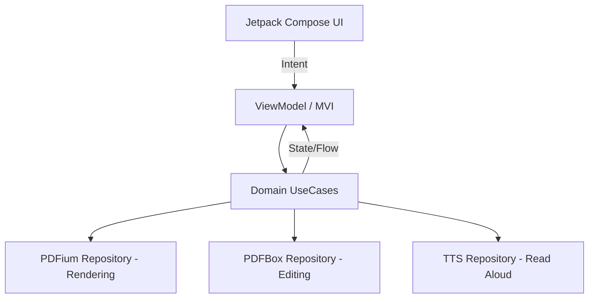

# PDF Reader Android App — Design & Architecture

## System Overview
A highly optimized, low-latency PDF reading Android app built purely for reading. Focuses on performance with minimal memory allocation, fast rendering, and clean UI. Core capabilities include reading PDFs, customizable high-lighting, pen annotation (embedded into the PDF), Eraser, and an even-toned Read Aloud feature.

---

## Tech Stack
- **Language**: Kotlin
- **UI Framework**: Jetpack Compose
- **PDF Rendering**: PDFium-Android (for optimal, low-latency, tiled rendering)
- **PDF Annotation & Modification**: Apache PDFBox (for parsing and embedding annotations back into the original PDF file)
- **Read Aloud**: Native Android TextToSpeech (TTS) API
- **Architecture Pattern**: MVI (Model-View-Intent) + Clean Architecture
- **Concurrency**: Kotlin Coroutines and Flows
- **CI/CD**: GitHub Actions (Builds triggered on `master` & PRs. Releases exclusively generated on `main` branch).

---

## Architecture
We use a **Clean Architecture + MVI** approach to strictly separate concerns and achieve a modular, testable application:



1.  **Presentation Layer (MVI)**
    - Jetpack Compose components.
    - ViewModels representing the state (`ReaderState`) and processing intents (`ReaderIntent` like `OnPageTurn`, `OnHighlightStarted`).
    - Focuses entirely on UI performance, ensuring no blocking operations exist here.
2.  **Domain Layer**
    - Pure Kotlin interfaces and UseCases (e.g., `GetPdfPageUseCase`, `SaveAnnotationUseCase`, `ReadTextAloudUseCase`).
    - Agnostic of Android Framework where possible.
3.  **Data Layer**
    - **PDFium Repository**: Maps domain models to PDFium API calls for fast rendering of pages as bitmaps. Employs tiled rendering for large zoom scales to prevent `OutOfMemoryError`.
    - **PDFBox Repository**: Handles the structural modification of the PDF, saving the paths and coordinates from the Presentation layer directly into the file standard.

---

## Core Modules
- `reader-core`: Handles file I/O, PDF parsing, and base models.
- `reader-render`: Integrates PDFium, providing fast Bitmap generation.
- `reader-editor`: Integrates PDFBox, handles annotation serialization.
- `reader-tts`: Handles text extraction and interfacing with the Android TTS engine.
- `app`: The Android application module integrating all sub-modules via Compose UI.

---
## Project Structure
```
app/
 ┣ src/main/java/com/pdfreader/app/
 ┃ ┣ data/         # Repositories, PDFium/PDFBox implementations
 ┃ ┣ domain/       # UseCases, Models
 ┃ ┣ presentation/ # ViewModels, Jetpack Compose UI
```

---

## Future Enhancements
- Local NPU-based voice model for higher quality Read Aloud (e.g., Piper TTS via ONNX/TFLite).
- Cloud Sync: Directly opening and syncing PDFs from Google Drive.
- Format Support: ePub and other text-based formats.


