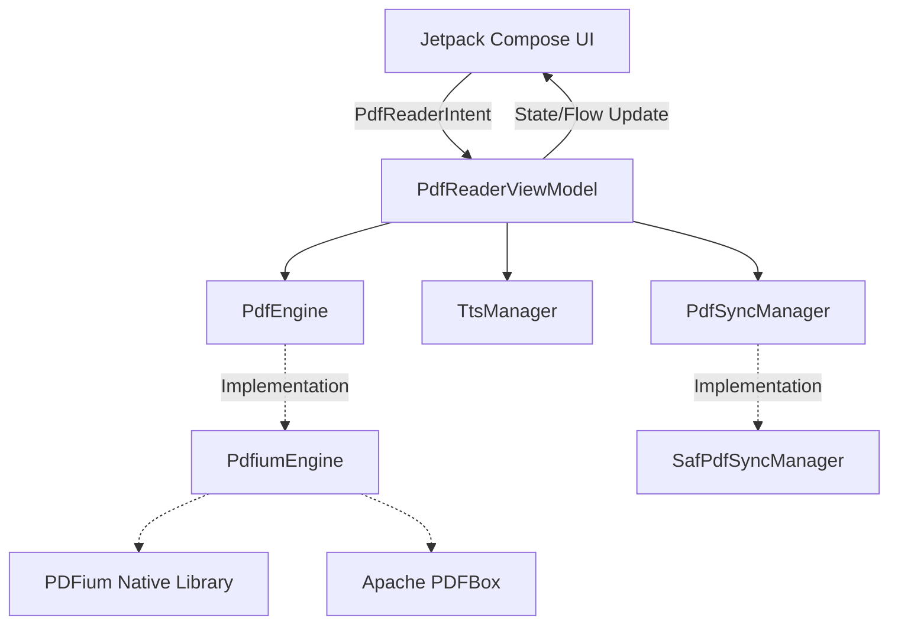

# PDF Reader Android App — Design & Architecture

## System Overview
A highly optimized, low-latency PDF reading Android app built purely for Readers. Focuses on performance with minimal memory allocation, fast rendering, and clean UI. Core capabilities include reading PDFs, customizable highlighting, pen annotation, and an even-toned Read Aloud feature.

---

## Tech Stack
- **Language**: Kotlin
- **UI Framework**: Jetpack Compose
- **PDF Rendering**: PDFium-Android (for optimal, low-latency rendering)
- **PDF Text Extraction**: Apache PDFBox (used alongside PDFium for extracting text and bounding boxes for features like TTS and highlighting)
- **Read Aloud**: Native Android TextToSpeech (TTS) API
- **Architecture Pattern**: MVI (Model-View-Intent) + Clean Architecture principles
- **Concurrency**: Kotlin Coroutines and Flows
- **CI/CD**: GitHub Actions (Builds triggered on `master` & PRs. Releases exclusively generated on `main` branch).

---

## Architecture
We use an **MVI + Clean Architecture** approach to separate concerns and achieve a modular, testable application within a single module:


```mermaid
graph TD
    UI[Jetpack Compose UI] -->|PdfReaderIntent| VM[PdfReaderViewModel]
    VM -->|State/Flow Update| UI
    VM --> D1[PdfEngine]
    VM --> D2[TtsManager]
    VM --> D3[PdfSyncManager]
    D1 -.->|Implementation| R1[PdfiumEngine]
    D3 -.->|Implementation| R2[SafPdfSyncManager]
    R1 -.-> PDFium[PDFium Native Library]
    R1 -.-> PDFBox[Apache PDFBox]
```

1.  **Presentation Layer (MVI)**
    - Jetpack Compose components (`BookshelfScreen`, `PdfReaderScreen`, `SettingsScreen`).
    - ViewModels representing the state (e.g., `PdfReaderState`) and processing intents (e.g., `PdfReaderIntent`).
    - Focuses entirely on UI performance, ensuring no blocking operations exist here. Navigation is handled via Jetpack Navigation Compose in `MainActivity`.
2.  **Domain Layer**
    - Pure Kotlin interfaces and managers (`PdfEngine`, `PdfSyncManager`, `TtsManager`).
    - Provides a unified API for the Presentation layer, abstracting away the underlying PDF or sync implementations.
3.  **Data Layer**
    - **PdfiumEngine**: Implements `PdfEngine`. Maps domain models to PDFium API calls for fast rendering of pages as bitmaps. It also integrates **PDFBox** internally to parse and extract text bounding boxes (`PdfTextBox`) needed for text selection, highlighting, and TTS.
    - **SafPdfSyncManager**: Implements `PdfSyncManager`. Manages persisting edited local PDFs directly back into Google Drive or other content providers via the Android Storage Access Framework (SAF).

---

## Package Structure
The app is built as a single Android module (`app`) containing distinct logical layers.

```text
app/
 ┣ src/main/java/com/pdfreader/app/
 ┃ ┣ data/
 ┃ ┃ ┣ pdfium/       # PdfiumEngine implementation (Rendering + PDFBox Text Extraction)
 ┃ ┃ ┗ sync/         # SafPdfSyncManager implementation (Storage Access Framework)
 ┃ ┣ domain/
 ┃ ┃ ┣ repository/   # Core Interfaces (PdfEngine, PdfSyncManager)
 ┃ ┃ ┗ tts/          # TtsManager for Read Aloud functionality
 ┃ ┣ presentation/
 ┃ ┃ ┣ mvi/          # State, Intents, and ViewModel (PdfReaderViewModel, Models)
 ┃ ┃ ┣ theme/        # Compose Theme definitions (NoxReaderTheme)
 ┃ ┃ ┗ ui/           # Jetpack Compose Screens (MainActivity, Bookshelf, Reader, Settings)
```

---

## Future Enhancements
- Local NPU-based voice model for higher quality Read Aloud (e.g., Piper TTS via ONNX/TFLite).
- Format Support: ePub and other text-based formats.
- Persistent Saving of Annotations: Implement serialization of in-memory annotations (highlights, pen strokes) back into the physical PDF file structure.
