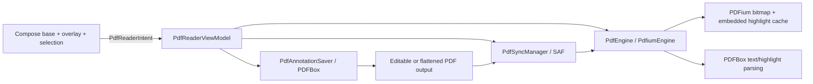

# PDF Reader Android App — Design & Architecture

## System overview

This is a low-latency Android PDF reader built for reading and annotation. PDFium owns static page rasterization; PDFBox owns text geometry, embedded annotation metadata, and durable PDF changes. Compose owns all interaction and optimistic UI feedback.

## Technology and boundaries

| Layer | Responsibility | Main components |
|---|---|---|
| Presentation | Compose UI, MVI intents/state, gesture handling, overlays | `PdfReaderScreen`, `PdfReaderViewModel`, `PdfReaderState` |
| Domain | Stable contracts for rendering, saving, and sync | `PdfEngine`, `PdfAnnotationSaver`, `PdfSyncManager` |
| Data | PDFium/PDFBox/SAF integration | `PdfiumEngine`, `PdfAnnotationWriterImpl`, `SafPdfSyncManager` |

```mermaid
flowchart LR
  UI["Compose base + overlay + selection"] -->|"PdfReaderIntent"| VM["PdfReaderViewModel"]
  VM --> ENGINE["PdfEngine / PdfiumEngine"]
  VM --> SAVER["PdfAnnotationSaver / PDFBox"]
  VM --> SYNC["PdfSyncManager / SAF"]
  ENGINE --> PDFIUM["PDFium bitmap + embedded highlight cache"]
  ENGINE --> PDFBOX_READ["PDFBox text/highlight parsing"]
  SAVER --> PDFBOX_WRITE["Editable or flattened PDF output"]
  PDFBOX_WRITE --> SYNC
  SYNC --> ENGINE
```

## Annotation pipeline

1. PDFium renders the static page bitmap. Compose draws in-progress pen/highlighter input, session annotations, selection bounds, and menus above it.
2. UI stores positions as normalized display-space values with a top-left origin.
3. `PdfCoordinateMapper` maps normalized coordinates to/from PDFBox CropBox coordinates, including right-angle page rotation. All PDFBox annotation creation and embedded-highlight loading use it.
4. On Save, the ViewModel snapshots pending state and performs PDFBox writing plus SAF sync on `Dispatchers.IO`.
5. After sync and successful reopen, `renderRevision` invalidates rendered pages and state caches. Only then are session overlays/deletion intents cleared.

### Save modes

- **Editable:** PDFBox keeps `/Annots` entries for highlights, ink, and text notes. New annotations include normal appearances.
- **Flattened:** PDFBox appends supported new annotation marks to page `/Contents`, then removes only those new annotation entries. Existing annotations remain intact.

## Embedded highlight selection

When a page becomes visible, `PdfiumEngine.getEmbeddedHighlights()` reads PDFBox highlight quads off the main thread and caches normalized rectangles. `HighlightHitTester` chooses the smallest matching highlight on an idle-tool tap. `SelectedHighlightOverlay` renders a dashed blue union bound and an in-window Delete action. Deletion updates state immediately and is persisted in the next save.

## Performance and lifecycle

- PDF rendering, PDFBox parsing/saving, text/highlight extraction, and SAF I/O run off the main thread.
- PDFBox document loading uses `MemoryUsageSetting.setupMixed(50 MiB)`.
- PDF documents and temporary save files are closed/deleted during close, replacement, save completion, and failure paths.
- The current page renderer is still a full-page bitmap. Tile/viewport rendering, bitmap eviction, and request cancellation are planned work; do not describe them as implemented.

## Verification and delivery

- Coordinate round-trip and overlap hit-testing JVM tests live in `app/src/test`.
- GitHub Actions is the only build/test environment; do not run local Gradle.
- `.github/workflows/gh-release.yml` generates releases on `main` and `feature` pushes.

## Feature mapping

| Feature file | Design sections | Current scope |
|---|---|---|
| `implementation-files/feature01.md` | Annotation pipeline; Performance and lifecycle | Rendering/coordinate/overlay foundation |
| `implementation-files/feature02.md` | Annotation pipeline; Save modes | Persistent editable and flattened annotations |
| `implementation-files/feature03.md` | Embedded highlight selection | Existing-highlight selection and deletion |
