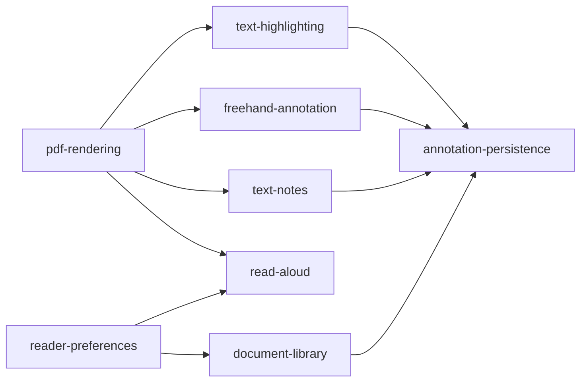

# NoxReader Feature Blueprint Manifest

This manifest is the only task-routing table for feature work. Shared technical
contracts live in [`.github/architecture.md`](../.github/architecture.md). A
blueprint explains the consequences of those contracts for one feature without
redefining them.

## Loading protocol

1. Match the request by intent and synonyms in the task router.
2. Load the single primary blueprint.
3. Load only the architecture headings linked by that blueprint.
4. Inspect the listed implementation and tests before changing behavior or
   status claims.
5. Load an impact-check blueprint only when the requested change touches the
   condition stated in its relationship.
6. Stop expanding context once the task, contracts, implementation, and
   verification boundary are clear.

If no row matches, inspect the directly relevant files; do not force a blueprint
onto isolated CI, dependency, or general documentation work. If routing remains
uncertain, inspect likely code entry points before loading more documents.

Read the complete architecture and every manifest-listed consumer only for a
structural, cross-cutting, persistence-wide, coordinate-contract, or genuinely
ambiguous change. Shared files such as `PdfReaderScreen.kt` and
`PdfReaderViewModel.kt` implement many features, so filenames alone are not task
classifiers.

## Task router

| Task concepts and synonyms | Primary blueprint | Architecture sections | Principal code and tests | Impact checks |
|---|---|---|---|---|
| open PDF, picker, document library, bookshelf, recent, continue reading, resume page, reading progress, bookmark, persisted URI permission | [`document-library.md`](document-library.md) | [Information architecture](../.github/architecture.md#information-architecture), [Component model and state ownership](../.github/architecture.md#component-model-and-state-ownership), [Local data and privacy](../.github/architecture.md#local-data-and-privacy), [Performance and lifecycle](../.github/architecture.md#performance-and-lifecycle) | `MainActivity`, library models/repository, `BookshelfScreen`, ViewModel open/close/progress flows | Persistence for write permission or unsaved close; preferences for history controls |
| render, bitmap, PDFium, page canvas, pager, zoom, viewport, tile, cache, cancellation | [`pdf-rendering.md`](pdf-rendering.md) | [Rendering and overlay model](../.github/architecture.md#rendering-and-overlay-model), [Coordinate system](../.github/architecture.md#coordinate-system), [Performance and lifecycle](../.github/architecture.md#performance-and-lifecycle), [Failure handling and invalidation](../.github/architecture.md#failure-handling-and-invalidation) | `PdfiumEngine`, reader page UI, render intents, coordinate mapper/tests | Annotation and read-aloud blueprints when page transforms, overlay alignment, or invalidation change |
| read aloud, TTS, narration, utterance, chunking, spoken range, synchronized speech highlight, play, pause, resume, replacement document, language, voice | [`read-aloud.md`](read-aloud.md) | [Component model and state ownership](../.github/architecture.md#component-model-and-state-ownership), [Coordinate system](../.github/architecture.md#coordinate-system), [Text geometry and highlighting](../.github/architecture.md#text-geometry-and-highlighting), [Rendering and overlay model](../.github/architecture.md#rendering-and-overlay-model), [Performance and lifecycle](../.github/architecture.md#performance-and-lifecycle) | `TtsManager`, TTS intents/state/ViewModel flow, reader controls and overlay | Preferences for speech rate; highlighting when shared text geometry changes |
| setting, preference, Proto DataStore, persistence schema, schema migration, transactional metadata, theme, dark mode, system theme, keep screen awake, speech-rate setting, annotation palette setting, pen color setting, highlighter color setting, privacy setting, clear-history UI, reduced motion | [`reader-preferences.md`](reader-preferences.md) | [Information architecture](../.github/architecture.md#information-architecture), [Visual system](../.github/architecture.md#visual-system), [Component model and state ownership](../.github/architecture.md#component-model-and-state-ownership), [Local data and privacy](../.github/architecture.md#local-data-and-privacy), [Performance and lifecycle](../.github/architecture.md#performance-and-lifecycle) | Proto schema/serializer/migrations/repository and tests, `SettingsScreen`, ViewModel preference flow, activity effects | Document library is required for any shared schema or migration change; read aloud for rate; freehand annotation for palette use; reader features for contrast |
| save, flatten, editable, PDFBox, SAF sync, null output stream, read-only provider, reopen, appearance stream, annotation write failure | [`annotation-persistence.md`](annotation-persistence.md) | [Commit pipeline](../.github/architecture.md#commit-pipeline), [Save modes](../.github/architecture.md#save-modes), [Failure handling and invalidation](../.github/architecture.md#failure-handling-and-invalidation), [Performance and lifecycle](../.github/architecture.md#performance-and-lifecycle) | annotation writer/saver, SAF sync manager, ViewModel save flow and writer tests | Every annotation blueprint whose persisted representation changes; library when URI capability changes |
| highlight, selection, text geometry, quad points, highlight color, embedded highlight | [`text-highlighting.md`](text-highlighting.md) | [Coordinate system](../.github/architecture.md#coordinate-system), [Text geometry and highlighting](../.github/architecture.md#text-geometry-and-highlighting), [Rendering and overlay model](../.github/architecture.md#rendering-and-overlay-model), [Commit pipeline](../.github/architecture.md#commit-pipeline) | selector, hit tester, reader overlays, embedded-highlight cache and tests | Persistence when save/delete or PDF output changes; read aloud when shared geometry changes |
| pen, ink, stroke, freehand highlight, eraser, pressure, stroke width, ink palette, pen color | [`freehand-annotation.md`](freehand-annotation.md) | [Coordinate system](../.github/architecture.md#coordinate-system), [Rendering and overlay model](../.github/architecture.md#rendering-and-overlay-model), [Commit pipeline](../.github/architecture.md#commit-pipeline), [Performance and lifecycle](../.github/architecture.md#performance-and-lifecycle) | annotation models/intents, reader gestures, ink writer and writer tests | Persistence when `/Ink`, flattening, or save behavior changes; preferences when palette storage or Settings ownership changes; highlighting for shared Highlighter-tool fallback |
| text note, sticky note, comment, note popup, note icon, blank note, empty note | [`text-notes.md`](text-notes.md) | [Coordinate system](../.github/architecture.md#coordinate-system), [Rendering and overlay model](../.github/architecture.md#rendering-and-overlay-model), [Commit pipeline](../.github/architecture.md#commit-pipeline), [Failure handling and invalidation](../.github/architecture.md#failure-handling-and-invalidation) | annotation models/intents, note editor UI, text-annotation writer and writer tests | Persistence when `/Text`, appearance, flattening, or save behavior changes |

## Evidence and status rules

Use evidence in this order:

1. Current implementation and verified test results.
2. Shared contracts in `architecture.md`.
3. Blueprint status prose and remaining gaps.
4. Product wishes or unverified notes, explicitly labelled as planned or unknown.

Status vocabulary:

- `Planned`: specified but not implemented.
- `Partial`: some acceptance criteria are present; named gaps or verification
  work remain.
- `Implemented`: present in current code with proportionate automated coverage.
- `Verified`: implemented and validated in the environments named by the
  blueprint.
- `Unknown`: evidence is insufficient; inspect before changing the claim.
- `Deprecated`: retained only for migration or compatibility.

Update a blueprint's status, evidence date, implementation map, acceptance
criteria, and gaps whenever relevant behavior changes. Never infer completion
from documentation alone.

## Blueprint content contract

Every blueprint must remain useful without conversational context and contain:

1. `Outcome` - the observable capability and its boundary.
2. `Current verified status` - an evidence-based label, inspection or
   verification date, and concise implemented facts.
3. `Architecture dependencies` - links to exact shared-contract headings.
4. `Feature-specific implications` - the concrete consequence of each linked
   contract, without copying its invariant or formula.
5. `Related blueprints` - separate Required and Impact checks with the condition
   that activates each relationship.
6. `Relevant implementation and tests` - exact repository paths plus each
   file's responsibility; explicitly say when coverage is absent.
7. `Acceptance criteria` - observable, testable outcomes, not implementation
   tasks.
8. `Remaining gaps` - current risks, missing behavior, and unverified claims.

Keep shared ownership, lifecycle, coordinate, persistence, privacy, and failure
rules authoritative in `architecture.md`. Do not duplicate formulas, maintain
chronological work logs, or describe planned behavior as current behavior.

## Dependency map

Arrows mean "load or inspect the target only under the relationship stated in
the source blueprint," not "always load both."

## Routing checks

| Representative request | Smallest sufficient context |
|---|---|
| Fix a revoked recent-document permission flow | `document-library.md` plus local-data and lifecycle contracts |
| Fix multiline highlight selection | `text-highlighting.md` plus coordinate, text-geometry, and overlay contracts |
| Add pressure-sensitive pen strokes | `freehand-annotation.md` plus coordinate and overlay contracts; persistence only if the durable model changes |
| Continue narration on the next page | `read-aloud.md` plus its lifecycle, text-geometry, and rendering dependencies |
| Change the speech-rate slider range | `reader-preferences.md` with a `read-aloud.md` impact check |
| Add a Proto field or change local metadata migration | Complete local-data contract, `reader-preferences.md`, and required `document-library.md` impact check |
| Fix flattened annotation save-back | `annotation-persistence.md`, complete commit/save contracts, and every affected annotation type |
| Change normalized coordinates | Complete `architecture.md` plus every coordinate consumer in the router |
| Change text-note popup styling | `text-notes.md` plus the overlay contract; no freehand behavior |
| Change unrelated CI caching | Direct workflow files; no blueprint unless a feature verification contract changes |
